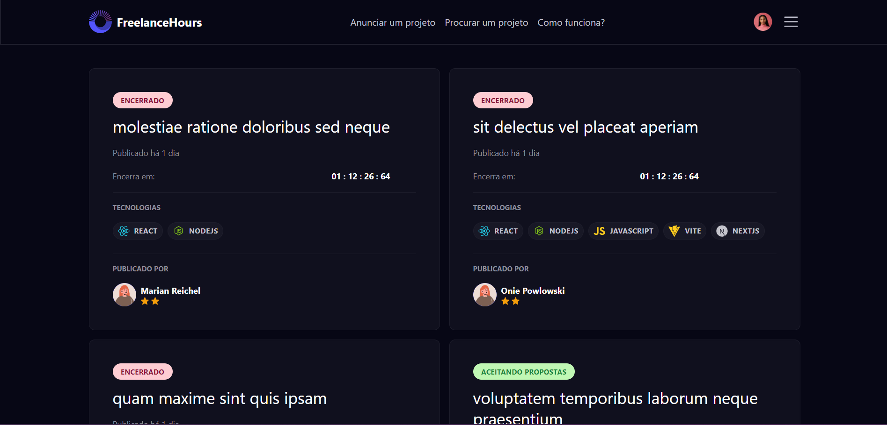
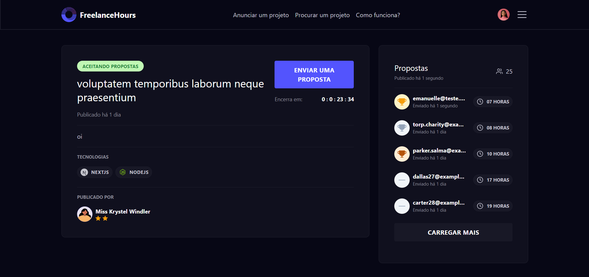

# Plataforma de Alocação de Desenvolvedores

Bem-vindo à Plataforma de Alocação de Desenvolvedores, uma aplicação que conecta desenvolvedores a projetos em busca de propostas. Aqui, os desenvolvedores podem explorar projetos disponíveis e enviar suas propostas, facilitando a colaboração e a alocação de talentos.

## Tecnologias Utilizadas

- : Gerenciador de dependências para PHP.
- : Linguagem de programação para a lógica do servidor.

## Funcionalidades

- **Visualização de Projetos**: Navegue por projetos disponíveis na plataforma.
- **Envio de Propostas**: Os desenvolvedores podem enviar propostas para projetos de seu interesse.
- **Interface Intuitiva**: Uma interface de usuário amigável e responsiva.

## Imagens da Aplicação

### Homepage

### Modal

### Projeto

